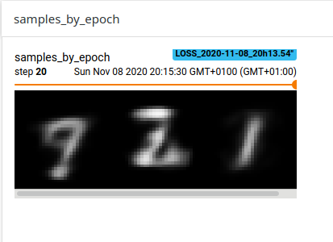
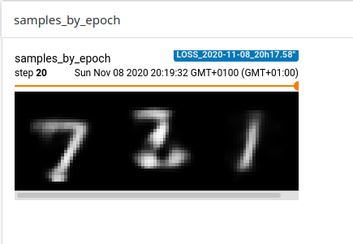
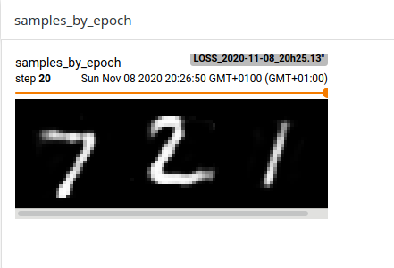
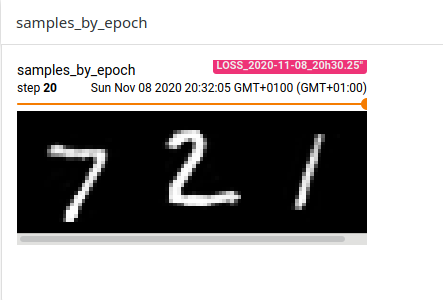
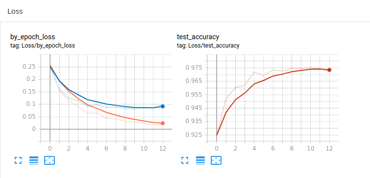

# AutoEncoder-and-Highway-network-on-MNIST-with-PyTorch
Implementation of simple ANNs with pytorch : Autoencoder and HighWay Network on MNIST.  

Theoretical context, emprical results and analysis are to be found in this (in french).

## AutoEncoder
Reconstruction for different dimensions of latent space :

Dim = 5           |  Dim = 10
:-------------------------:|:-------------------------:
  |  

Dim =  40           |  Dim = 80
:-------------------------:|:-------------------------:
  |  

## HighWay Network :
Loss and Accuracy for different numbers of HighWay layers :
L = 9           |  L = 19
:-------------------------:|:-------------------------:
  |  

